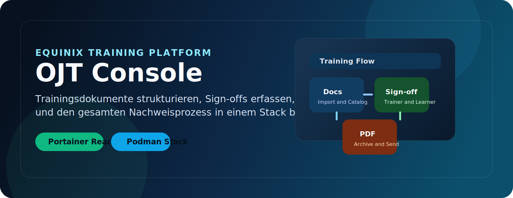
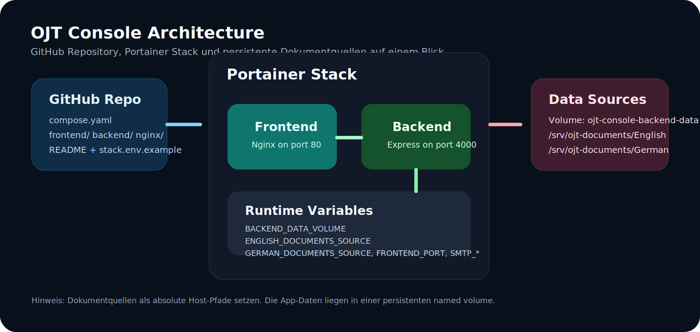
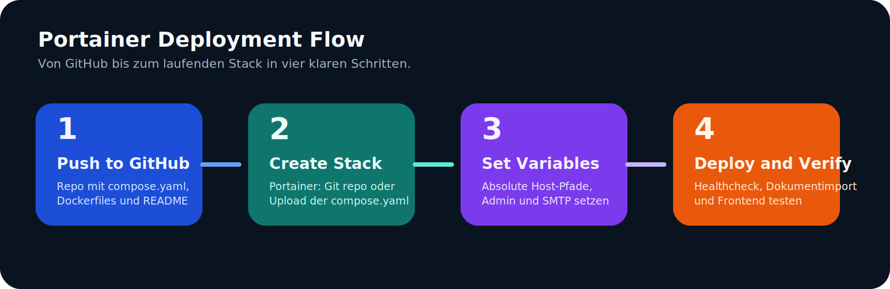

# OJT Console

<p align="center">
  
</p>

<p align="center">
  <strong>Interne OJT-Webanwendung fuer Training, Sign-off, PDF-Erzeugung und kontrollierten Versand.</strong>
</p>

<p align="center">
  <a href="https://github.com/marcodessi-equinix/OJT-Console"></a>
  
  
  
  
</p>

## Ueberblick

OJT Console ist eine interne Trainingsanwendung fuer Customer Operations. Die App importiert vorhandene OJT-Dokumente, stellt sie als strukturierte Trainingsmodule bereit, fuehrt Trainer und Mitarbeitende durch den Sign-off-Prozess und erzeugt daraus versandfaehige PDF-Nachweise.

Der Stack ist so vorbereitet, dass du ihn lokal entwickeln, als GitHub-Repository versionieren und anschliessend in Portainer auf einem Podman-Host als Stack deployen kannst.

<p align="center">
  
</p>

## Highlights

| Bereich | Beschreibung |
| --- | --- |
| Dokumentimport | Importiert DOC, DOCX, PDF und TXT aus Englisch- und Deutsch-Ordnern |
| Rollenmodell | Admin-Login und Trainer-Login mit PIN-Flow |
| Trainingsfluss | Dokumente ansehen, Module starten, Fortschritt sichern, Delivery abschliessen |
| PDF-Output | Generiert Nachweise mit Signaturen und Trainingsdaten |
| Versand | SMTP optional, manueller Versandfluss bleibt als Fallback nutzbar |
| Deployment | Vite-Frontend + Express-Backend + Nginx via Compose fuer Podman/Portainer |

## Tech Stack

- Frontend: React, TypeScript, Vite
- Backend: Node.js, Express, TypeScript
- Storage: SQLite via sql.js
- PDF: pdf-lib
- Mail: nodemailer
- Reverse Proxy: Nginx
- Container: Podman / Portainer Stack Deployment

## Repository-Struktur

```text
.
|- backend/
|- frontend/
|- nginx/
|- scripts/
|- docs/assets/
|- compose.yaml
|- docker-compose.yml
|- .env.example
|- stack.env.example
|- README.md
```

## Schnellstart lokal

### Development

```bash
npm install
copy .env.example .env
npm run dev
```

Frontend: `http://localhost:5173`

Backend Health: `http://localhost:4000/api/health`

### Production Build lokal pruefen

```bash
npm run build
```

## OJT-Dokumente

Die App sucht Dokumente standardmaessig in diesen Quellen:

- `English/`
- `German/`
- `OJT English/`
- `OJT German/`
- `OJT C-OPS/English` bzw. `OJT C-OPS/German`
- `OJT F-OPS/English` bzw. `OJT F-OPS/German`
- alternativ ueber `DOCUMENTS_ROOT`, `ENGLISH_DOCUMENTS_ROOT`, `GERMAN_DOCUMENTS_ROOT`

Die echten Trainingsdokumente sollten nicht ins Repository eingecheckt werden. Die wichtigsten lokalen Dokumentordner und Laufzeitdaten sind bereits in [.gitignore](.gitignore) und [.dockerignore](.dockerignore) ausgeschlossen.

## GitHub-Upload

Das Projekt ist inhaltlich fuer GitHub vorbereitet. Vor dem ersten Push solltest du nur noch dein lokales Git-Repository initialisieren und mit deinem Ziel-Repository verbinden:

```bash
git init
git add .
git commit -m "Initial commit"
git branch -M main
git remote add origin https://github.com/marcodessi-equinix/OJT-Console.git
git push -u origin main
```

## Portainer auf Podman

### Empfohlene Variante

Nutze in Portainer einen Stack aus dem Git-Repository oder lade [compose.yaml](compose.yaml) direkt hoch. Fuer Git-Deployments liegt zusaetzlich [docker-compose.yml](docker-compose.yml) im Repo, damit Portainer auch mit dem Standardpfad direkt deployen kann. Fuer die Umgebungsvariablen kannst du [stack.env.example](stack.env.example) als Vorlage nehmen.

### Wichtige Voraussetzungen

- Der Podman-Host sollte schreibbare absolute Linux-Pfade fuer Daten und Quelldokumente haben.
- Relative Volume-Pfade aus Git-Stacks sind in Portainer nicht in jeder Edition gleich nutzbar. Fuer eine robuste Installation solltest du die drei Mount-Pfade explizit als absolute Host-Pfade setzen.
- Portainer dokumentiert fuer Podman offiziell einen root-basierten Host als Standardfall. Rootless Podman kann funktionieren, ist aber nicht die konservative Standardannahme.
- Bei Git-Stacks wird das komplette Repository auf den Host geklont. Das Repository sollte daher keine grossen Rohdaten oder Submodule enthalten.

### Portainer-Variablen

Mindestens diese Variablen solltest du im Stack setzen:

```env
BACKEND_DATA_PATH=/srv/ojt-console/data
ENGLISH_DOCUMENTS_SOURCE=/srv/ojt-documents/English
GERMAN_DOCUMENTS_SOURCE=/srv/ojt-documents/German
FRONTEND_PORT=8080
ADMIN_IDENTIFIER=admin
ADMIN_NAME=OJT Admin
ADMIN_PIN=1234
```

Optional je nach Versand:

```env
MAIL_FROM=ojt-app@example.com
DEFAULT_PRIMARY_RECIPIENT=training-owner@example.com
DEFAULT_CC_ME=
SMTP_HOST=
SMTP_PORT=587
SMTP_SECURE=false
SMTP_USER=
SMTP_PASS=
```

### Deploy-Ablauf in Portainer

1. Stack anlegen.
2. `Git repository` oder `Upload` waehlen.
3. Repository-URL `https://github.com/marcodessi-equinix/OJT-Console.git` eintragen oder [compose.yaml](compose.yaml) hochladen.
4. Falls Git genutzt wird: Standardpfad `docker-compose.yml` funktioniert direkt. Alternativ kannst du den Compose-Dateipfad explizit auf `compose.yaml` setzen.
5. Umgebungsvariablen aus [stack.env.example](stack.env.example) oder manuell pflegen.
6. Deploy ausfuehren.
7. Anwendung ueber `http://<server>:<FRONTEND_PORT>` aufrufen.

### Was du beim ersten Stack-Deploy beachten musst

- Wenn die Dokumentpfade leer oder falsch sind, startet das Backend nicht sauber, weil es die OJT-Quellen beim Booten erwartet.
- Wenn Portainer keine Builds aus dem Git-Repo ausfuehren darf, musst du den Stack per Upload/Web Editor deployen oder spaeter auf vorgebaute Images umstellen.
- Wenn SMTP nicht gesetzt ist, bleibt die App trotzdem nutzbar. Der Versandfluss faellt dann auf den manuellen Prozess zurueck.
- Die SQLite-Datenbank und erzeugte PDFs liegen unter `BACKEND_DATA_PATH`. Dieses Verzeichnis muss dauerhaft persistent sein.

<p align="center">
  
</p>

## Containerbetrieb lokal

```bash
copy .env.example .env
podman-compose up -d --build
```

Danach ist das Frontend unter `http://localhost:8080` erreichbar.

## Standard-Umgebungsvariablen

Die komplette Vorlage liegt in [.env.example](.env.example). Fuer Portainer ist [stack.env.example](stack.env.example) die bessere Basis.

## Verifikation

Folgendes wurde lokal validiert:

- `npm run build` laeuft erfolgreich durch
- Compose-Datei ist fuer Podman/Portainer-Variablen vorbereitet
- Repo ignoriert Laufzeitdaten, lokale Dokumente und `.env`

Nicht lokal validiert in dieser Windows-Session:

- echter `podman` oder `podman-compose` Lauf
- echter Portainer-Stack-Deploy gegen deinen Zielhost

## Naechste sinnvolle Schritte

1. Git lokal initialisieren und in `https://github.com/marcodessi-equinix/OJT-Console.git` pushen.
2. Auf dem Podman-Server die drei Host-Verzeichnisse anlegen.
3. In Portainer den Stack mit absoluten Host-Pfaden deployen.
4. Nach dem ersten Start `api/health` und den Dokumentimport pruefen.
